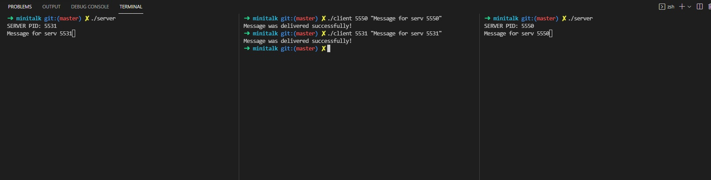

  What is it?
  -------------
  This is the simple like client-server applicantion in C.
  By program you can send messages from client to server using server PID
  
  Usage
  ----------
  ```
  make
  ./server
  ./client [PID_OF_SERVER] [MESSAGE]
  ```
  
  Examples
  ----------
  
  
  
    
  
    
